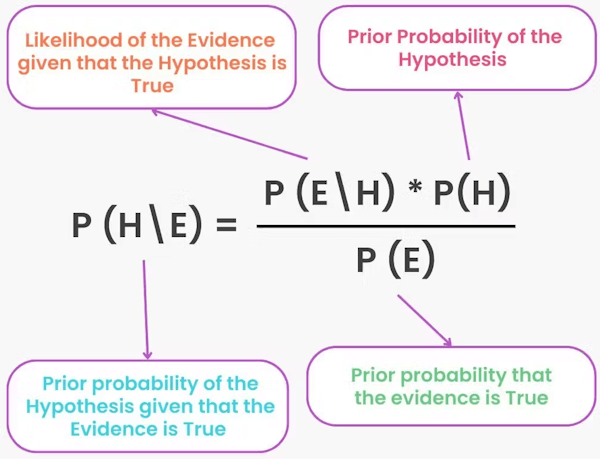

## 1. Naive Bayes
The Naive Bayes algorithm is a simple yet powerful method for classifying data, like deciding if an email is spam or not. It uses **Bayes' Theorem** to calculate the probability of a data point belonging to a certain class based on its features, assuming those features are independent of each other. 

## 2. What it does?

**Classification**: Naive Bayes is used to **predict the category** or label of a new data point based on its features.

**Supervised learning**: It's a supervised learning algorithm, meaning **it learns from labeled data** to make predictions.

**Probability based**: It relies on probabilities to make its decisions, making it a **probabilistic classifier**.

## 3. The "Naive" Part
**Independence Assumption**: The key assumption is that each feature (e.g. the presence of a word in an email) is **independent** of the others, given the class. This "naive" assumption simplifies the calculations and is often a good approximation in many real-world scenarios.

**Example**: Imagine you're trying to classify a fruit as an apple based on its color, shape, and size. A Naive Bayes classifier would assume that the color of the fruit (red) doesn't tell you much about the shape (round), given that you're trying to classify it as an apple. 

## 4. How it works?
**Bayes' Theorem**
It uses Bayes' Theorem to calculate the probability of a class given the features:
* $P(A|B) = P(B|A) * P(A) / P(B)$
* $P(A|B)$: The probability of event A happening given that event B has happened (the probability of a class given the features). 
* $P(B|A)$: The probability of event B happening given that event A has happened (the probability of the features given a class). 
* $P(A)$: The prior probability of event A (the probability of a class before observing any features). 
* P(B)$: The probability of event B (the probability of the features).

**Calculating Probabilities**: The algorithm calculates the prior probability of each class, the likelihood of observing the features given each class, and then uses Bayes' Theorem to compute the posterior probability of each class given the observed features.

**Making a Prediction**: It then predicts the class with the highest posterior probability. 

## 5. Advantages
**Simplicity**: Easy to implement and computationally efficient.

**Speed**: Works well with large datasets and is particularly fast in making predictions.

**Versatility**: Can be used for both binary and multi-class classification problems. 

## 6. Disadvantages
**Independence Assumption**: The assumption of feature independence can be a limitation, as features are often correlated in real-world scenarios.

**Zero Probability Problem**: If a feature doesn't appear in the training data for a particular class, the algorithm might assign a zero probability to it, which can lead to problems during prediction. 

## 7. When to use NB classification
A Naive Bayes classifier is a good choice when you need to **classify text data**, and the assumption of **feature independence** is reasonable.

## 8. Naive Bayes model types
There are four types of the Naive Bayes Model:

**Gaussian Naive Bayes**: It is a straightforward algorithm used when the attributes are continuous. The attributes present in the data should follow the rule of Gaussian distribution or normal distribution. It remarkably quickens the search, and under lenient conditions, the error will be two times greater than Optimal Naive Bayes.

**Optimal Naive Bayes**: Optimal Naive Bayes selects the class that has the greatest posterior probability of happenings. As per the name, it is optimal. But it will go through all the possibilities, which is very slow and time-consuming.

**Bernoulli Naive Bayes**: Bernoulli Naive Bayes is an algorithm that is useful for data that has binary or boolean attributes. The attributes will have a value of yes or no, useful or not, granted or rejected, etc.

**Multinominal Naive Bayes**: Multinominal Naive Bayes is used on documentation classification issues. The features needed for this type are the frequency of the words converted from the document.

## 9. Applications

The Naive Bayes Algorithm is used for various real-world problems like:

**Text/Document classification**: The Naive Bayes Algorithm is used as a probabilistic learning technique for text classification. It is one of the best-known algorithms used for document classification into different topics.

**Sentiment analysis**: The Naive Bayes Algorithm is used to analyze sentiments or feelings, whether positive, neutral, or negative.

**Recommendation system**: The Naive Bayes Algorithm is a collection of collaborative filtering issued for building hybrid recommendation systems that assist you in predicting whether a user will receive any resource.

**Spam filtering**: It is also similar to the text classification process. It is popular for helping you determine if the mail you receive is spam.

**Medical diagnosis**: This algorithm is used in medical diagnosis and helps you to predict the patient’s risk level for certain diseases.

**Weather prediction**: You can use this algorithm to predict whether the weather will be good.

**Face recognition**: This helps you identify faces.
